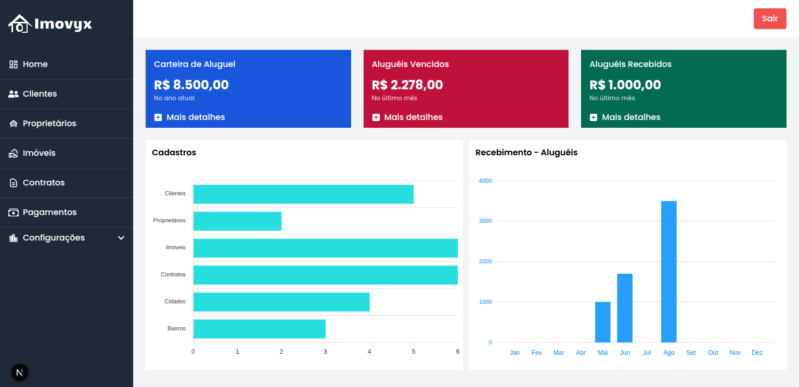

# Imovyx

**Imovyx** é uma aplicação web desenvolvida em **React** com **TypeScript**, focada na gestão imobiliária para administradoras de imóveis. Este repositório contém apenas o frontend da aplicação, responsável pela interface e experiência do usuário.

## ✨ Visão Geral

O sistema permite o gerenciamento completo de imóveis, proprietários, clientes e contratos de locação, oferecendo uma interface moderna, responsiva e intuitiva para facilitar as operações do dia a dia no setor imobiliário.

## Este frontend consome uma API construída com **Ruby on Rails**.

## 🧱 Tecnologias Utilizadas

- **React**
- **TypeScript**
- **React Query** (para gerenciamento de dados assíncronos e cache)
- **Tailwind CSS** (para estilização)
- **Next.js** (ou Next.js, caso esteja usando — edite conforme necessário)
- Integração com API Rails via **JWT**

---

## 🔐 Autenticação

A autenticação é baseada em **tokens JWT** gerados pelo backend Rails com `Devise` + `devise-jwt`. O token é armazenado em local seguro e usado nas requisições autenticadas via headers.

---

## 🏠 Funcionalidades Principais

- Cadastro e listagem de **imóveis**
- Gerenciamento de **proprietários** e **clientes**
- Cadastro e acompanhamento de **contratos de locação**
- Controle de **pagamentos mensais**
- Localização dos imóveis via **latitude/longitude**
- Interface para **administração e controle de acessos**
- Filtragem por cidade, bairro, tipo de imóvel, etc.

---

## 🚀 Deploy

A aplicação está hospedada via **Vercel**:

🔗 [Link para o ambiente de produção](https://imovyx.vercel.app)

## ⚙️ Instalação e Execução Local

```bash
# Clone o repositório
git clone https://github.com/rodrigocnn/imovyx.git

# Acesse o diretório
cd imovyx

# Instale as dependências
npm install

# Crie um arquivo .env com as variáveis de ambiente necessárias (exemplo abaixo)

# Execute em modo de desenvolvimento
npm run dev
```

## 🗂 Estrutura do Projeto

```bash

src/
├── assets/       # Arquivos estáticos ou estilizações adicionais (ex: imagens, SVGs, fontes)
├── components/   # Componentes reutilizáveis como botões, inputs, modais, etc.
├── hooks/        # Hooks personalizados com lógica reutilizável em toda a aplicação
├── interfaces/   # Definições de tipos e interfaces TypeScript de uso global
├── modules/      # Módulos organizados por domínio/funcionalidade (ex: auth, dashboard, etc.)
├── pages/        # Páginas principais da aplicação, geralmente associadas às rotas
├── services/     # Lógicas de comunicação com APIs (ex: instâncias e chamadas com Axios)
├── styles/       # Estilizações globais (ex: configuração do Tailwind, variáveis CSS)
└── utils/        # Funções utilitárias e helpers de uso geral
```

## 🧾 Backend

Este frontend consome uma API Rails robusta, com as seguintes entidades principais:

users (admin)
clients (locatários)
owners (proprietários de imóveis)
properties (imóveis disponíveis)
rental_contracts (contratos de locação)
rent_payments (mensalidades de aluguel)
cities e neighborhoods

A autenticação é realizada via JWT, e a segurança de acesso é garantida por middlewares e validações de token.

## 🧑‍💻 Contribuindo

No momento, este projeto é privado e não está aberto a contribuições externas.

📸 Screenshots

 <p align="center">
     
 </p>

🧠 Autor
Desenvolvido por [Seu Nome], programador com experiência em React, Rails e sistemas de gestão.

📄 Licença
Este projeto está licenciado sob a MIT License.
